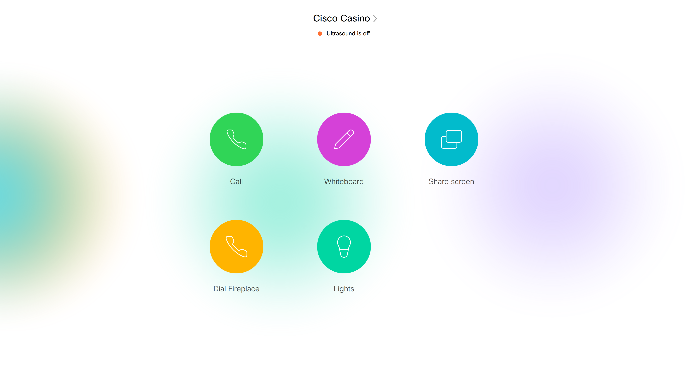

# Webex Devices Integrations - High level overview

Cisco Webex Devices supports a large and varied API set. All components are well documented by themselves, but it can be overwhelming for customers and developers to understand which API technology to choose, and why.

This guide gives a brief overview of the most important components ("puzzle pieces"), and some tips on when to choose one over the other. For each of the component, there is a runnable example as well.

TODO Refer to git repo here

## Mini dictionary

* xAPI - the core protocol used to manipulate the video system, such as making calls, adjusting volume etc
* Macros - snippets of JavaScript code that customers can write that runs on the video system itself
* jsxapi - JavaScript SDK for the xAPI, open source and available for eg Node.js
* Cloud xAPI - RESTful xAPI access for cloud registered devices
* Video device web interface - a web admin site on the video endpoints that lets you configure it
* User interface extensions - panels, buttons and widgets that can be added to the user interface of the video device to allow user to control lights, blinds, make speed dials etc
* In-room controls - the previous name for User interface extensions
* Web apps - web pages running on the newer Webex devices with the Chromium web engine
* xAPI over web socket - web browsers etc can speak directly to the xAPI over web socket, if it knows the username and password for the video system
* Bot apis - rest apis and web hooks for sending/receiving bot messages on Webex Teams

For each integration type, you can read:
- How it works
- An example, and screenshot
- When to use/not use it
- Which devices support it
- Required configs, flags, permissions, software versions
- Link to more documentation

## xAPI

The xAPI is the language for speaking to the video system. All integrations, and also Cisco's internal code such as the user interfaces, uses the xAPI to communicate with the video system and retrieve status data.


### Examples

The easiest way to play with the xAPI is to login with TShell from the command line. Here's how you can start a call using the xAPI and SSH from your laptop:

* Open a console terminal

* Connect to your video endpoint (replace the ip addresse with your video devices addresse):

`ssh admin@10.47.90.231`

* Once you are in, you can start browsing the api tree with autocomplete (use the tab key often)

* `xCommand`, `xStatus` and `xConfig` are good starting points

* To call a number that shows a fireplace:

`xCommand Dial Number: fireplace@ivr.vc`

* To see the number of active calls (verify that active calls is 1):

`xStatus SystemUnit State`

* You can register feedback to be notified any time a value changes:

`xFeedback Register status/systemunit/state`

* Observe that you now get a message any time a call is started or stopped.

That's a super short overview of the main features of the xAPI. You can use the xAPI to control and observe almost anything that the video system supports, such as starting calls, adding participants, doing screen share, controlling camera, adjusting volume, muting, changing video layout etc.

The best way to get the xAPI is to just play with it from the command line. Try to think of work flows that you would like to automate (start a call, add a third participant, adjust the volume to a certain setting, turn on sticky self view, choose equal layout etc) and see if you can do it all from the keyboard.

For a full reference guide, see:

https://www.cisco.com/c/en/us/support/collaboration-endpoints/spark-room-kit-series/products-command-reference-list.html

TODO: add xevents

## Macros and user interface extensions

Macros are snippets of code (scripts) written in JavaScript that can run on the video system itself, to customise the behaviour of the video system. A benefit of this is that you do not need any additional hardware, such as virtual machines or mini servers. Macros are typically written and tested in the macro editor, which can be accessed on the web interface of the video system itself.

A typical use case is for the macros to listen for events from custom user interface extensions. These extensions can be buttons and sliders for controlling peripherals in the room such as lights, blinds, climate controls, projectors, or to modify the behaviour of the video system to suit particular work flows, for example adding quick dials to the home screen.

The macros also support communicating with with the external world using HTTP GET, POST etc, greatly increasing their usability.

Supported devices: All devices running CE 8 and higher, except SX10 and Webex Share (TODO VERIFY)


Deployments: both on-prem and cloud

Required configuration: `xConfiguration Macro Mode: On` (can be enabled in macro editor too)

Documentation:
* See TODO for full documentation
* See the help section in macro editor for examples, and also a comprehensive tutorial

<div>
  
  
  
</div>

*UI Extensions editor, macro editor and custom home screen*

### Example:

The following example starts a call on the video system to a fireplace. The action is triggered when a button with panel id `fireplace` is pressed.

```
const xapi = require('xapi');

// Called every time a custom home screen button is tapped
function guiEvent(event) {
  if (event.PanelId === 'fireplace') {
    xapi.command('Dial', { Number: 'fireplace@ivr.vc' });
  }
}

xapi.event.on('UserInterface Extensions Panel Clicked', guiEvent);
```

See the `macro-user-extensions` example in the Git repo for the UI Extensions file and the macro.

Documentation: TODO link

## User interface Extensions

User interface extensions allow you to add new UI elements to the Webex devices. For example, you can make panels with buttons for controlling the light in the room, adjusting the temperature, controlling the projector, or reporting technical problems. You can also make controls that makes it easier to access features of the video system that you frequently use.

The custom interfaces can be created easily the the drag and drop extensions editor on the video device itself. When a user interacts with a widget, an event is generated that you can listen to in either a macro or with an external integration such as the jsxapi. Based on the id of the widget, you can then choose what actions to perform.

The custom user interface extensions contain basic UI elements such as buttons, toggles, sliders and tabs. If you need more advanced user interfaces, such as a map, consider using a web app instead.

TODO link to inroom docs here

## jsxapi and Node.js

The same JavaScript that was used in the macro above can also be run on an external Node server with almost no modifications, for example in a virtual machine or a Raspberry Pi. For this, we recommend the jsxapi, which are JavaScript bindings (SDK) for talking to the video system.

Requirements for this solution:

- Your integration can reach the video system on the network
- The network allows SSH
- Your integration can have user access (typically admin user or integrator user)

The main benefits over a macro integration:

- You can use system libraries (SDK for external web services, interact with non-IOT peripherals in the room)
- Your integration is centralised, so if you need to update it often, you don't need to update a macro on each endpoint
- You can use third party libraries, eg to control hardware in your room, machine learning, screen scraping, etc


### Example

For this example to work, you need to have Node and npm installed. Search the web for how to install for your operating system if you don't have it already.

Make sure the jsxapi bindings are downloaded and installed by typing `npm install` in the root folder of the Git repo.

Starting a call now from an external server is easy, if you have the username and password to log on to the video system:

```
// Import the library for talking with the xAPI
const jsxapi = require('jsxapi');

// Replace with your credentials
const codec = {
  host: '10.47.112.232',
  username: 'admin',
  password: 'host',
};

// Connect to the video system
const xapi = jsxapi.connect('ssh://' + codec.host, {
  username: codec.username,
  password: codec.password,
});

// Start a call
xapi.command('Dial', { Number: 'fireplace@ivr.vc' });
```

Test the runnable example in the `jsxapi` folder, edit your codec settings in `main.js`. It should connect, call the fireplace then automatically disconnect and quit. To run it, cd to `jsxapi` folder in your shell and type:

`node main.js`

The above setup is a good starting point if you need to listen to events from the video system and perform actions based on it.

### Requirements

The jsxapi should work with any video system that has xAPI.

Required configs:

```
xConfiguration NetworkServices Mode: On
```

### jsxapi with Express web server


If you want people to be able to interact with the jsxapi above from other devices than eg the Cisco Touch 10, a simple way is to integrate the jsxapi with a web server. Strictly speaking, this has nothing to do with Webex APIs, but we have included an example here anyway to get you quickly started.

Express is a minimal Node.js web server that's easy to set up. After installing it with npm, you can embed it with jsxapi like this:

```
const xapi = require('./xapi');
const express = require('express');
const app = express();
const port = 3000;

app.get('/call/:number', (req, res) => {
  const { number } = req.params;
  xapi.dial(number);
  res.send('Call! ' + number);
});
app.get('/endCall', (req, res) => {
  xapi.hangUp();
  res.send(true);
});

// serve html files, assets etc from this folder:
app.use(express.static('public'));

app.listen(port, () => console.log(`Example app listening on port ${port}!`));
```

This hooks up a REST Api with the jsxapi, so a call can be started from eg a user's mobile phone.

Check out the full example in the `webserver` folder of the Git repo. If you haven't already, type
`npm install` in the repo's root directory to install dependencies. cd to the `webserver` folder,
then type `node server.js` to start the server.

Visiting `http://localhost:3000` in your browser should give you a page to dial.

You can test the server itself by typing this in your browser's URL bar:

`http://localhost:3000/call/fireplace@ivr.vc`

It should place a call. The following request should hang up:

`http://localhost:3000/endCall`


## xAPI over web socket

In the example above, the web page is talking to the video device via an Express web server. Since CE 9.8 (TODO verify) it is also possible to connect directly to the video device using web sockets, eg from a web page. This means you do not need a dedicated web server to handle the communication.

Please note that this solution requires that the web page contains the username and password to connect to the video system, so it should only be used for integrations where the end user is trusted access to the video system, such as web pages for administering the video device.

TODO link and example here


## Web apps


The newer Webex devices with touch screens support web apps, which are basically web views with interactive content pointing to external URLs.

Making web apps for the Cisco devices is basically like making any other web page, but you might want to optimise for the the use case of being on a shared device, as well as adjust sizes for big screen and tune performance.

The web engine is powered by Chromium, so most of the stuff you expect from a full browser is available, such as HTML5 tags, EcmaScript 6 syntax, CSS3, local storage, canvas, SVG, web sockets etc. Note that only one "tab" is supported.

Included is a web app for doing a simple white boarding. You can use this basis or inspiration for an alternative whiteboard with some features that you would like, such as a dedicated brain storming app, a whiteboard with shape support, automatic OCR etc.

To add the web app to your video device:

* Go to your video endpoints web admin interface
* Select Integrations > UI Extensions Editor
* Add new extension (web app)
* Add a name, and set the url (your laptops ip and port)
* Export the configuration
* It should now appear on the home screen of your video device
* Click the web app button to test it, click home to go back

Note that you can turn on remote debugging. This lets you use Chrome's dev console on your laptop to view and manipulate the web app on the video device.

Config:
`xConfig WebEngine RemoteDebugging: On`

For full information on what the web engine supports, see the developer guide. TODO link

## Design guidelines

If you design your own apps to be used specifically for Webex devices, you might like to use the Cisco styles, such as fonts, icons and colors. These are freely available at momentum.design.


Remaining examples

* web sockets: call, show events

unsure
* bot, integrations, webex api
* cloud xapi
* http putxml / postman stuff
* http feedback
