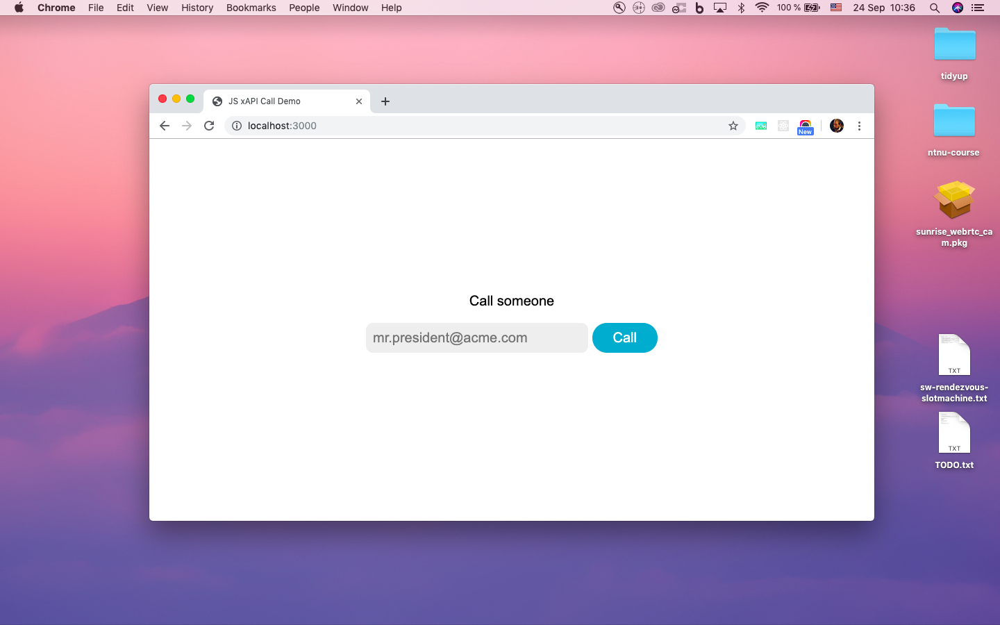
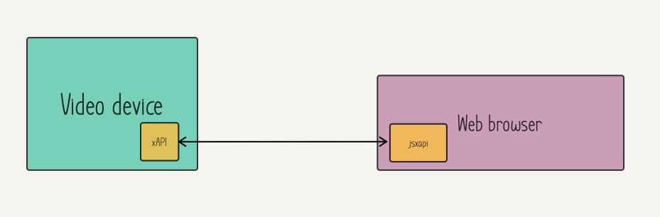

# Webex Device API Overview

Cisco Webex Devices supports a large and varied API set. All components are well documented individually, but it can be overwhelming initially for developers and customers to understand which API technology to use, and why.


This guide gives a brief overview of the most important components ("puzzle pieces"), and some tips on when to choose one over the other. For each component, there are runnable examples as well, to give you a taste of how it works and to get quickly started.

Read the separate install guide (INSTALL.md) for how to set up the examples on your laptop.

This guide and the examples can be found by cloning the public Git repository:

`git clone https://bitbucket.org/bjolseth/ntnu-hackathon.git`


## Mini dictionary

* **xAPI** - the core protocol used to manipulate the video system, such as making calls, adjusting volume etc
* **Macros** - snippets of JavaScript code that customers can write that runs on the video system itself
* **jsxapi** - JavaScript SDK for the xAPI, open source and available for eg Node.js
* **Web interface** - a web admin interface on the video endpoint that lets you configure it
* **User interface extensions** - panels, buttons and widgets that can be added to the user interface of the video device to allow user to control lights, blinds, make speed dials etc
* **Web apps** - web pages running on the newer Webex devices with the Chromium web engine
* **xAPI over web socket** - web browsers etc can speak directly to the xAPI over web socket
* **Bot apis** - REST apis and web hooks for sending/receiving bot messages on Webex Teams

For each integration type, you can read:

* How it works
* An example, and screenshot
* Recommendations on when to use / not use it
* Which devices support it
* Required configs, flags, permissions, software versions
* Link to more documentation

## xAPI

The xAPI is the language for speaking to the video system. All integrations, and also Cisco's internal code such as the user interfaces, uses the xAPI to communicate with the video system.


### Examples

The easiest way to play with the xAPI is to login with `TShell` from the command line. Here's how you can start a call using the xAPI and SSH from your laptop:

* Open a console terminal

* Connect to your video endpoint (replace the ip address with your video devices address):

`ssh admin@10.47.90.231`

* Once you are in, you can start browsing the api tree with auto complete (use the tab key)

* `xCommand`, `xStatus` and `xConfig` are good starting points

* To call a number that shows a fireplace:

`xCommand Dial Number: fireplace@ivr.vc`

* To see the number of active calls (verify that active calls is 1):

`xStatus SystemUnit State`

* You can register feedback to be notified any time a value changes:

`xFeedback Register status/systemunit/state`

* Observe that you now get a message any time a call is started or stopped.

* You can listen to events to. To listen to all events (for learning):

`xFeedback Register event/*`


That's a super short overview of the main features of the xAPI. You can use it to control and observe almost anything that the video system supports, such as starting calls, adding participants, doing screen share, controlling camera, adjusting volume, muting, changing video layout etc.

The best way to learn the xAPI is to just play with it from the command line. Try to think of work flows that you would like to automate (start a call, add a third participant, adjust the volume to a certain setting, turn on sticky self view, choose equal layout etc) and see if you can do it all from the keyboard.

See more:

* Full API doc: See the api guide in the reference-docs folder
* More examples in the examples/xapi folder

## User interface Extensions

<div>
  
  
</div>

User interface extensions allow you to add new UI elements to the Webex devices. For example, you can make panels with buttons for controlling the light in the room, adjusting the temperature, controlling the projector, or reporting technical problems. You can also add shortcuts to features that you frequently use on the video system. Web apps can also be added from here.

The custom interfaces can be created easily with the drag and drop extensions editor from the web interface. When a user interacts with a widget, an event is generated that you can listen to in either a macro or with an external integration such as the jsxapi. Based on the id of the widget, you can then choose what actions to perform.

The custom user interface extensions contain basic UI elements such as buttons, toggles, sliders and tabs. They generate basic events, so they can be used to control virtually anything you choose. If you need advanced user interfaces, with polished graphics or eg a clickable map, consider using a web app instead.

The editor is available from the video device's web interface in the `Integrations` sub menu.

* Full documentation: See the customization guide in the reference-docs folder


## Macros and user interface extensions

Macros are snippets of code (scripts) written in JavaScript that can run on the video system itself, to customise the behaviour and automate common tasks. A benefit of this is that you do not need any additional hardware, such as virtual machines, Raspberry PIs or similar. Macros are typically written and tested in the macro editor, which can be accessed on the web interface of the video system itself.

A typical use case is for the macros to listen for events from custom user interface extensions. These extensions can be buttons and sliders for controlling peripherals in the room such as lights, blinds, climate controls, projectors, or to modify the behaviour of the video system to suit particular work flows, for example adding quick dials to the home screen.

The macros also support communicating with the external world using HTTP GET, POST etc.


Required configuration: `xConfiguration Macro Mode: On` (can be enabled in macro editor too)

Documentation:
* See the help section in macro editor for examples, and also the tutorial available there

*UI Extensions editor, macro editor and custom home screen*

### Example:

The following example starts a call on the video system to a fireplace. The action is triggered when a button with panel id `fireplace` is pressed.

```
const xapi = require('xapi');

// Called every time a custom home screen button is tapped
function guiEvent(event) {
  if (event.PanelId === 'fireplace') {
    xapi.command('Dial', { Number: 'fireplace@ivr.vc' });
  }
}

xapi.event.on('UserInterface Extensions Panel Clicked', guiEvent);
```

## jsxapi and Node.js

The same JavaScript that was used in the macro above can also be run on an external Node server with almost no modifications, for example in a virtual machine or a Raspberry Pi. For this, we recommend the jsxapi, which are JavaScript bindings (SDK) for talking to the video system.

Links:

* Npm: https://www.npmjs.com/package/jsxapi
* Github: https://github.com/cisco-ce/jsxapi
* More examples: https://github.com/ObjectIsAdvantag/xapi-samples/tree/master/jsxapi

Requirements for this solution:

- Your integration can reach the video system on the network
- The network allows SSH
- Your integration can have user access (typically admin user or integrator user)

The main benefits over a macro integration:

- You can use system libraries (SDK for external web services, interact with non-IOT peripherals in the room)
- Your integration is centralised, so if you need to update it often, you don't need to update a macro on each endpoint
- You can use third party libraries, eg to control hardware in your room, machine learning, screen scraping, etc


### Example

For this example to work, you need to have Node and npm installed. Starting a call now from an external server is easy and can be done with very similar to the macros.

```
// Import the library for talking with the xAPI
const jsxapi = require('jsxapi');

// Replace with your credentials
const codec = {
  host: '10.47.112.232',
  username: 'admin',
  password: 'host',
};

// Connect to the video system
const xapi = jsxapi.connect('ssh://' + codec.host, {
  username: codec.username,
  password: codec.password,
});

// Start a call
xapi.command('Dial', { Number: 'fireplace@ivr.vc' });
```

Test the runnable example in the `jsxapi` folder, edit your codec settings in `main.js`. It should connect, call the fireplace then automatically disconnect and quit. To run it:

```
cd examples/jsxapi
node main.js
```

The above setup is a good starting point to expand on if you need to listen to events from the video system and perform actions based on it.

### Configs

The jsxapi should work with any video system that has xAPI. Required configs:

```
xConfiguration NetworkServices Mode: On
```

### jsxapi with Express web server


If you want people to be able to interact with the jsxapi from their laptop or mobile devices, a simple way is to integrate the jsxapi with a web server. Strictly speaking, this has nothing to do with Webex APIs, but we have included an example here anyway to get you quickly started.

Express is a minimal Node.js web server that's easy to set up. After installing it with npm, you can embed it with jsxapi like this:

```
const xapi = require('./xapi');
const express = require('express');
const app = express();
const port = 3000;

app.get('/call/:number', (req, res) => {
  const { number } = req.params;
  xapi.dial(number);
  res.send('Call! ' + number);
});
app.get('/endCall', (req, res) => {
  xapi.hangUp();
  res.send(true);
});

// serve html files, assets etc from this folder:
app.use(express.static('public'));

app.listen(port, () => console.log(`Example app listening on port ${port}!`));
```

This hooks up a REST Api with the jsxapi, so a call can be started from eg a user's mobile phone.

Check out the full example in the `webserver` folder of the Git repo. If you haven't already, type
`npm install` in the repo's root directory to install dependencies. cd to the `webserver` folder,
then type `node server.js` to start the server.



Visiting `http://localhost:3000` in your browser should show you a simple page where you can place and end a call.

You can test the server itself (without the web page) by typing this in your browser's URL bar:

`http://localhost:3000/call/fireplace@ivr.vc`

It should place a call. The following request should hang up:

`http://localhost:3000/endCall`


## xAPI over web socket

In the example above, the web page is talking to the video device via an Express web server. It is also possible to connect directly to the video device using web sockets, eg from a web page. This means you do not need a dedicated web server in between to handle the communication. The jsxapi supports the web socket as a transport mechanism, so you are able to write almost the same code as with macros and the web server example above.


The provided example is a web page that sets up a direct web socket connection to a video system, then registers to receive all events. Like the other examples, it can be used as a basis to get quickly started, but it is also a tool to inspect the events that the video system generates.

The web socket solution requires that the web page contains the username and password to connect to the video system, so it should only be used for integrations where the end user is trusted access to the video system, such as web pages for administering the video device. Also, the end user needs to be on the same network as the device.



Required configs:

```
xConfiguration NetworkServices HTTP Mode: HTTP+HTTPS
xConfiguration NetworkServices WebSocket: On
```

## Web apps


The newer Webex devices with touch screens support web apps, which are basically web views with interactive content pointing to external URLs.

Making web apps for the Cisco devices is basically like making any other web page, but you might want to optimise for the the use case of being on a shared device, as well as adjust sizes for big screen and tune performance.

The web engine is powered by Chromium, so most of the features you expect from a full browser is available, such as HTML5 tags, EcmaScript 6 syntax, CSS3, local storage, canvas, SVG, web sockets etc. Note that only one "tab" is supported.

Included is a web app for doing simple white boarding, with automatic line straightening. You can use this basis or inspiration for an alternative whiteboard with some features that you would like, such as a dedicated brain storming app, a whiteboard with shape support, automatic OCR etc. See http://paperjs.org/ for API, this is of course just one of thousands of JavaScript libraries you can use to create cool web app features.

To add the web app to your video device:

* Start the UI Extensions editor
* Add new extension (web app)
* Add a name, and set the url (the ip and port for the web server on your laptop)
* Export the configuration
* It should now appear on the home screen of your video device
* Click the web app button to test it, click home to go back

The video device automatically uses the favicon on the home screen, if your web page provides one.


Note that you can turn on remote debugging. This lets you use Chrome's dev console on your laptop to view and manipulate the web app on the video device.

Config:

* Set `xConfig WebEngine RemoteDebugging: On`
* Open `10.47.90.231:9222` in Chrome on your laptop (replace ip)

Docs:

* See the web engine developer guide in `reference-docs/`

## Webex APIs and Bots

A powerful feature of the Webex platform is the Bot API. It allows user to communicate with bots for automated services. This works on both laptop and clients with Webex Teams.

A bot is similar to a user, and easy to create. It can join conversations and answer direct messages and group chats where it is mentioned. An example is a bot that translates messages, sends reminders, or creates polls.

Recently Cisco also added a **cards** API, making it easy to add buttons and simple user interface elements to the bot conversations. This facilitates services such as polls, simple calendars etc.

Sending a message to a person from a bot is just a simple REST call. Whenever a message is sent to the bot, the Webex cloud notifies your web server with **web hooks**. If your bot server is behind a firewall or intranet, you can use **ngrok** to relay the messages (for temporary test purposes).


The developer.webex.com site provides interactive ways to test your bots easily and learn the API, making it very easy to get started.

Links:

* https://developer.webex.com/

## Design guidelines and assets

If you design your own apps to be used specifically for Webex devices, you might like to use the Cisco styles, such as fonts, icons and colours. These are freely available at momentum.design.

The web socket example above is using the Momentum design assets, see that for an example on how to integrate with React.


Links:

* momentum.design - find the design resources here
